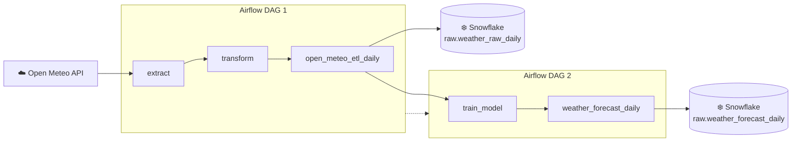

# Lab 1 Weather Analytics Report

## Overview
This project aims to design and implement a weather prediction analytics system leveraging Snowflake, Apache Airflow, and the Open-Meteo API. By automating historical weather data ingestion and machine learning forecasting pipelines, we efficiently predict the next 7-day maximum temperature for multiple locations. The project demonstrates the integration of ETL and ML workflows within a cloud-based data warehouse architecture using transactional safety and automated orchestration.
## System Diagram

## Results

## Airflow UI Screenshots
